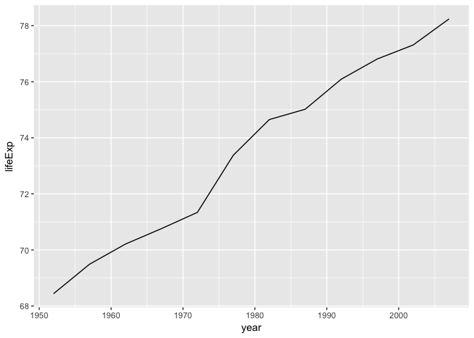

Transform Data (solutions)
================

<!-- This file by Charlotte Wickham is licensed under a Creative Commons Attribution 4.0 International License, adapted from the orignal work at https://github.com/rstudio/master-the-tidyverse by RStudio. -->
``` r
library(tidyverse)
library(gapminder)

# Toy dataset to use
pollution <- tribble(
       ~city,   ~size, ~amount, 
  "New York", "large",      23,
  "New York", "small",      14,
    "London", "large",      22,
    "London", "small",      16,
   "Beijing", "large",      121,
   "Beijing", "small",      56
)
```

gapminder
---------

``` r
gapminder
```

    ## # A tibble: 1,704 x 6
    ##    country     continent  year lifeExp      pop gdpPercap
    ##    <fctr>      <fctr>    <int>   <dbl>    <int>     <dbl>
    ##  1 Afghanistan Asia       1952    28.8  8425333       779
    ##  2 Afghanistan Asia       1957    30.3  9240934       821
    ##  3 Afghanistan Asia       1962    32.0 10267083       853
    ##  4 Afghanistan Asia       1967    34.0 11537966       836
    ##  5 Afghanistan Asia       1972    36.1 13079460       740
    ##  6 Afghanistan Asia       1977    38.4 14880372       786
    ##  7 Afghanistan Asia       1982    39.9 12881816       978
    ##  8 Afghanistan Asia       1987    40.8 13867957       852
    ##  9 Afghanistan Asia       1992    41.7 16317921       649
    ## 10 Afghanistan Asia       1997    41.8 22227415       635
    ## # ... with 1,694 more rows

Your Turn 1
-----------

See if you can use the logical operators to manipulate our code below to show:

The data for United States

``` r
filter(gapminder, country == "United States")
```

    ## # A tibble: 12 x 6
    ##    country       continent  year lifeExp       pop gdpPercap
    ##    <fctr>        <fctr>    <int>   <dbl>     <int>     <dbl>
    ##  1 United States Americas   1952    68.4 157553000     13990
    ##  2 United States Americas   1957    69.5 171984000     14847
    ##  3 United States Americas   1962    70.2 186538000     16173
    ##  4 United States Americas   1967    70.8 198712000     19530
    ##  5 United States Americas   1972    71.3 209896000     21806
    ##  6 United States Americas   1977    73.4 220239000     24073
    ##  7 United States Americas   1982    74.6 232187835     25010
    ##  8 United States Americas   1987    75.0 242803533     29884
    ##  9 United States Americas   1992    76.1 256894189     32004
    ## 10 United States Americas   1997    76.8 272911760     35767
    ## 11 United States Americas   2002    77.3 287675526     39097
    ## 12 United States Americas   2007    78.2 301139947     42952

All data for countries in Oceania

``` r
filter(gapminder, continent == "Oceania")
```

    ## # A tibble: 24 x 6
    ##    country   continent  year lifeExp      pop gdpPercap
    ##    <fctr>    <fctr>    <int>   <dbl>    <int>     <dbl>
    ##  1 Australia Oceania    1952    69.1  8691212     10040
    ##  2 Australia Oceania    1957    70.3  9712569     10950
    ##  3 Australia Oceania    1962    70.9 10794968     12217
    ##  4 Australia Oceania    1967    71.1 11872264     14526
    ##  5 Australia Oceania    1972    71.9 13177000     16789
    ##  6 Australia Oceania    1977    73.5 14074100     18334
    ##  7 Australia Oceania    1982    74.7 15184200     19477
    ##  8 Australia Oceania    1987    76.3 16257249     21889
    ##  9 Australia Oceania    1992    77.6 17481977     23425
    ## 10 Australia Oceania    1997    78.8 18565243     26998
    ## # ... with 14 more rows

Rows where the life expectancy is greater than 82

``` r
filter(gapminder, lifeExp > 82)
```

    ## # A tibble: 2 x 6
    ##   country          continent  year lifeExp       pop gdpPercap
    ##   <fctr>           <fctr>    <int>   <dbl>     <int>     <dbl>
    ## 1 Hong Kong, China Asia       2007    82.2   6980412     39725
    ## 2 Japan            Asia       2007    82.6 127467972     31656

Your Turn 2
-----------

Use Boolean operators to alter the code below to return only the rows that contain:

-   United States before 1970

``` r
filter(gapminder, country == "United States", year < 1970)
```

    ## # A tibble: 4 x 6
    ##   country       continent  year lifeExp       pop gdpPercap
    ##   <fctr>        <fctr>    <int>   <dbl>     <int>     <dbl>
    ## 1 United States Americas   1952    68.4 157553000     13990
    ## 2 United States Americas   1957    69.5 171984000     14847
    ## 3 United States Americas   1962    70.2 186538000     16173
    ## 4 United States Americas   1967    70.8 198712000     19530

-   Countries where life expectancy in 2007 is below 50

``` r
filter(gapminder, year == 2007, lifeExp < 50)
```

    ## # A tibble: 19 x 6
    ##    country                  continent  year lifeExp       pop gdpPercap
    ##    <fctr>                   <fctr>    <int>   <dbl>     <int>     <dbl>
    ##  1 Afghanistan              Asia       2007    43.8  31889923       975
    ##  2 Angola                   Africa     2007    42.7  12420476      4797
    ##  3 Burundi                  Africa     2007    49.6   8390505       430
    ##  4 Central African Republic Africa     2007    44.7   4369038       706
    ##  5 Congo, Dem. Rep.         Africa     2007    46.5  64606759       278
    ##  6 Cote d'Ivoire            Africa     2007    48.3  18013409      1545
    ##  7 Guinea-Bissau            Africa     2007    46.4   1472041       579
    ##  8 Lesotho                  Africa     2007    42.6   2012649      1569
    ##  9 Liberia                  Africa     2007    45.7   3193942       415
    ## 10 Malawi                   Africa     2007    48.3  13327079       759
    ## 11 Mozambique               Africa     2007    42.1  19951656       824
    ## 12 Nigeria                  Africa     2007    46.9 135031164      2014
    ## 13 Rwanda                   Africa     2007    46.2   8860588       863
    ## 14 Sierra Leone             Africa     2007    42.6   6144562       863
    ## 15 Somalia                  Africa     2007    48.2   9118773       926
    ## 16 South Africa             Africa     2007    49.3  43997828      9270
    ## 17 Swaziland                Africa     2007    39.6   1133066      4513
    ## 18 Zambia                   Africa     2007    42.4  11746035      1271
    ## 19 Zimbabwe                 Africa     2007    43.5  12311143       470

-   Records for any of "New Zealand", "Canada" or "United States"

``` r
filter(gapminder, country %in% c("Canada", "New Zealand", "United States")) 
```

    ## # A tibble: 36 x 6
    ##    country continent  year lifeExp      pop gdpPercap
    ##    <fctr>  <fctr>    <int>   <dbl>    <int>     <dbl>
    ##  1 Canada  Americas   1952    68.8 14785584     11367
    ##  2 Canada  Americas   1957    70.0 17010154     12490
    ##  3 Canada  Americas   1962    71.3 18985849     13462
    ##  4 Canada  Americas   1967    72.1 20819767     16077
    ##  5 Canada  Americas   1972    72.9 22284500     18971
    ##  6 Canada  Americas   1977    74.2 23796400     22091
    ##  7 Canada  Americas   1982    75.8 25201900     22899
    ##  8 Canada  Americas   1987    76.9 26549700     26627
    ##  9 Canada  Americas   1992    78.0 28523502     26343
    ## 10 Canada  Americas   1997    78.6 30305843     28955
    ## # ... with 26 more rows

Your Turn 3
-----------

Use `filter()` to get the records for the US, then plot the life expectancy over time.

``` r
us <- filter(gapminder, country == "United States")
ggplot(us, mapping = aes(x = year, y = lifeExp)) +
  geom_line()
```



Your Turn 4
-----------

Find the records with the smallest population.

``` r
arrange(gapminder, pop)
```

    ## # A tibble: 1,704 x 6
    ##    country               continent  year lifeExp   pop gdpPercap
    ##    <fctr>                <fctr>    <int>   <dbl> <int>     <dbl>
    ##  1 Sao Tome and Principe Africa     1952    46.5 60011       880
    ##  2 Sao Tome and Principe Africa     1957    48.9 61325       861
    ##  3 Djibouti              Africa     1952    34.8 63149      2670
    ##  4 Sao Tome and Principe Africa     1962    51.9 65345      1072
    ##  5 Sao Tome and Principe Africa     1967    54.4 70787      1385
    ##  6 Djibouti              Africa     1957    37.3 71851      2865
    ##  7 Sao Tome and Principe Africa     1972    56.5 76595      1533
    ##  8 Sao Tome and Principe Africa     1977    58.6 86796      1738
    ##  9 Djibouti              Africa     1962    39.7 89898      3021
    ## 10 Sao Tome and Principe Africa     1982    60.4 98593      1890
    ## # ... with 1,694 more rows

Find the records with the largest GDP per capita.

``` r
arrange(gapminder, desc(gdpPercap))
```

    ## # A tibble: 1,704 x 6
    ##    country   continent  year lifeExp     pop gdpPercap
    ##    <fctr>    <fctr>    <int>   <dbl>   <int>     <dbl>
    ##  1 Kuwait    Asia       1957    58.0  212846    113523
    ##  2 Kuwait    Asia       1972    67.7  841934    109348
    ##  3 Kuwait    Asia       1952    55.6  160000    108382
    ##  4 Kuwait    Asia       1962    60.5  358266     95458
    ##  5 Kuwait    Asia       1967    64.6  575003     80895
    ##  6 Kuwait    Asia       1977    69.3 1140357     59265
    ##  7 Norway    Europe     2007    80.2 4627926     49357
    ##  8 Kuwait    Asia       2007    77.6 2505559     47307
    ##  9 Singapore Asia       2007    80.0 4553009     47143
    ## 10 Norway    Europe     2002    79.0 4535591     44684
    ## # ... with 1,694 more rows

Quiz
----

A function that returns a vector the same length as the input is called **vectorized**.

Which of the following functions are vectorized?

-   `ifelse()`
-   `diff()`
-   `sum()`

You might try these:

``` r
gapminder %>% 
  mutate(size = ifelse(pop < 10e06, "small", "large"))
```

    ## # A tibble: 1,704 x 7
    ##    country     continent  year lifeExp      pop gdpPercap size 
    ##    <fctr>      <fctr>    <int>   <dbl>    <int>     <dbl> <chr>
    ##  1 Afghanistan Asia       1952    28.8  8425333       779 small
    ##  2 Afghanistan Asia       1957    30.3  9240934       821 small
    ##  3 Afghanistan Asia       1962    32.0 10267083       853 large
    ##  4 Afghanistan Asia       1967    34.0 11537966       836 large
    ##  5 Afghanistan Asia       1972    36.1 13079460       740 large
    ##  6 Afghanistan Asia       1977    38.4 14880372       786 large
    ##  7 Afghanistan Asia       1982    39.9 12881816       978 large
    ##  8 Afghanistan Asia       1987    40.8 13867957       852 large
    ##  9 Afghanistan Asia       1992    41.7 16317921       649 large
    ## 10 Afghanistan Asia       1997    41.8 22227415       635 large
    ## # ... with 1,694 more rows

``` r
gapminder %>% 
  mutate(diff_pop = diff(pop))
```

    ## Error in mutate_impl(.data, dots): Column `diff_pop` must be length 1704 (the number of rows) or one, not 1703

``` r
gapminder %>% 
  mutate(total_pop = sum(as.numeric(pop)))
```

    ## # A tibble: 1,704 x 7
    ##    country     continent  year lifeExp      pop gdpPercap   total_pop
    ##    <fctr>      <fctr>    <int>   <dbl>    <int>     <dbl>       <dbl>
    ##  1 Afghanistan Asia       1952    28.8  8425333       779 50440465801
    ##  2 Afghanistan Asia       1957    30.3  9240934       821 50440465801
    ##  3 Afghanistan Asia       1962    32.0 10267083       853 50440465801
    ##  4 Afghanistan Asia       1967    34.0 11537966       836 50440465801
    ##  5 Afghanistan Asia       1972    36.1 13079460       740 50440465801
    ##  6 Afghanistan Asia       1977    38.4 14880372       786 50440465801
    ##  7 Afghanistan Asia       1982    39.9 12881816       978 50440465801
    ##  8 Afghanistan Asia       1987    40.8 13867957       852 50440465801
    ##  9 Afghanistan Asia       1992    41.7 16317921       649 50440465801
    ## 10 Afghanistan Asia       1997    41.8 22227415       635 50440465801
    ## # ... with 1,694 more rows

**Solution**:

`ifelse()` is vectorized, you always get a vector out the same length as the input vector.

`diff()` is not vectorized, you always get a vector out with one less element than the input vector.

`sum()` is not vectorized, it returns just one element regardless of the length of the input vector.

Your Turn 5
-----------

Alter the code to add a `prev_lifeExp` column that contains the life expectancy from the previous record.

(Hint: use cheatsheet, you want to offset elements by one)

Extra challenge: Why isn't this quite the 'life expectency five years ago'?

``` r
gapminder %>%
  mutate(prev_lifeExp = lag(lifeExp))
```

    ## # A tibble: 1,704 x 7
    ##    country     continent  year lifeExp      pop gdpPercap prev_lifeExp
    ##    <fctr>      <fctr>    <int>   <dbl>    <int>     <dbl>        <dbl>
    ##  1 Afghanistan Asia       1952    28.8  8425333       779         NA  
    ##  2 Afghanistan Asia       1957    30.3  9240934       821         28.8
    ##  3 Afghanistan Asia       1962    32.0 10267083       853         30.3
    ##  4 Afghanistan Asia       1967    34.0 11537966       836         32.0
    ##  5 Afghanistan Asia       1972    36.1 13079460       740         34.0
    ##  6 Afghanistan Asia       1977    38.4 14880372       786         36.1
    ##  7 Afghanistan Asia       1982    39.9 12881816       978         38.4
    ##  8 Afghanistan Asia       1987    40.8 13867957       852         39.9
    ##  9 Afghanistan Asia       1992    41.7 16317921       649         40.8
    ## 10 Afghanistan Asia       1997    41.8 22227415       635         41.7
    ## # ... with 1,694 more rows

Your Turn 6
-----------

Use summarise() to compute three statistics about the data:

-   The first (minimum) year in the dataset
-   The last (maximum) year in the dataset
-   The number of countries represented in the data (Hint: use cheatsheet)

``` r
gapminder %>% 
  summarise(first = min(year), 
            last = max(year),
            n_countries = n_distinct(country))
```

    ## # A tibble: 1 x 3
    ##   first  last n_countries
    ##   <dbl> <dbl>       <int>
    ## 1  1952  2007         142

Your Turn 7
-----------

Extract the rows where continent == "Africa" and year == 2007.

Then use summarise() and summary functions to find:

1.  The number of unique countries
2.  The median life expectancy

``` r
gapminder %>% 
  filter(continent == "Africa", year == 2007) %>% 
  summarise(n_countries = n_distinct(country),
    med_life_exp = median(lifeExp))
```

    ## # A tibble: 1 x 2
    ##   n_countries med_life_exp
    ##         <int>        <dbl>
    ## 1          52         52.9

Your Turn 8
-----------

Find the median life expectancy by continent in 2007

``` r
gapminder %>%
  filter(year == 2007) %>%
  group_by(continent) %>% 
  summarise(med_life_exp = median(lifeExp)) 
```

    ## # A tibble: 5 x 2
    ##   continent med_life_exp
    ##   <fctr>           <dbl>
    ## 1 Africa            52.9
    ## 2 Americas          72.9
    ## 3 Asia              72.4
    ## 4 Europe            78.6
    ## 5 Oceania           80.7

Your Turn 9
-----------

Brainstorm with your neighbor the sequence of operations to find: the country with biggest jump in life expectancy (between any two consecutive records) for each continent.

1.  Find jumps between time points for all countries:

    1.  Group by country
    2.  Add jump variable

2.  Arrange by decending jump

Your Turn 10
------------

Find the country with biggest jump in life expectancy (between any two consecutive records) for each continent.

``` r
# One of many solutions
gapminder %>%
  group_by(country) %>%
  mutate(prev_lifeExp = lag(lifeExp),
         jump = lifeExp - prev_lifeExp) %>%
  arrange(desc(jump))
```

    ## # A tibble: 1,704 x 8
    ## # Groups: country [142]
    ##    country     continent  year lifeExp       pop gdpPercap prev_lif…  jump
    ##    <fctr>      <fctr>    <int>   <dbl>     <int>     <dbl>     <dbl> <dbl>
    ##  1 Cambodia    Asia       1982    51.0   7272485       624      31.2 19.7 
    ##  2 China       Asia       1967    58.4 754550000       613      44.5 13.9 
    ##  3 Rwanda      Africa     1997    36.1   7212583       590      23.6 12.5 
    ##  4 Rwanda      Africa     2002    43.4   7852401       786      36.1  7.33
    ##  5 Mauritius   Africa     1957    58.1    609816      2034      51.0  7.10
    ##  6 Bulgaria    Europe     1957    66.6   7651254      3009      59.6  7.01
    ##  7 El Salvador Americas   1987    63.2   4842194      4140      56.6  6.55
    ##  8 China       Asia       1957    50.5 637408000       576      44.0  6.55
    ##  9 Myanmar     Asia       1957    41.9  21731844       350      36.3  5.59
    ## 10 Albania     Europe     1962    64.8   1728137      2313      59.3  5.54
    ## # ... with 1,694 more rows

Your Turn 11
------------

Use `left_join()` to add the country codes in `country_codes` to the gapminder data.

``` r
gapminder %>% left_join(country_codes)
```

    ## Joining, by = "country"

    ## Warning: Column `country` joining factor and character vector, coercing
    ## into character vector

    ## # A tibble: 1,704 x 8
    ##    country     continent  year lifeExp      pop gdpPercap iso_alpha iso_n…
    ##    <chr>       <fctr>    <int>   <dbl>    <int>     <dbl> <chr>      <int>
    ##  1 Afghanistan Asia       1952    28.8  8425333       779 AFG            4
    ##  2 Afghanistan Asia       1957    30.3  9240934       821 AFG            4
    ##  3 Afghanistan Asia       1962    32.0 10267083       853 AFG            4
    ##  4 Afghanistan Asia       1967    34.0 11537966       836 AFG            4
    ##  5 Afghanistan Asia       1972    36.1 13079460       740 AFG            4
    ##  6 Afghanistan Asia       1977    38.4 14880372       786 AFG            4
    ##  7 Afghanistan Asia       1982    39.9 12881816       978 AFG            4
    ##  8 Afghanistan Asia       1987    40.8 13867957       852 AFG            4
    ##  9 Afghanistan Asia       1992    41.7 16317921       649 AFG            4
    ## 10 Afghanistan Asia       1997    41.8 22227415       635 AFG            4
    ## # ... with 1,694 more rows

**Challenge**: Which codes in country\_codes have no matches in gapminder?

``` r
country_codes %>% anti_join(gapminder)
```

    ## Joining, by = "country"

    ## Warning: Column `country` joining character vector and factor, coercing
    ## into character vector

    ## # A tibble: 45 x 3
    ##    country    iso_alpha iso_num
    ##    <chr>      <chr>       <int>
    ##  1 Armenia    ARM            51
    ##  2 Aruba      ABW           533
    ##  3 Azerbaijan AZE            31
    ##  4 Bahamas    BHS            44
    ##  5 Barbados   BRB            52
    ##  6 Belarus    BLR           112
    ##  7 Belize     BLZ            84
    ##  8 Bhutan     BTN            64
    ##  9 Brunei     BRN            96
    ## 10 Cape Verde CPV           132
    ## # ... with 35 more rows

------------------------------------------------------------------------

Take aways
==========

-   Extract cases with `filter()`
-   Make new variables, with `mutate()`
-   Make tables of summaries with `summarise()`
-   Do groupwise operations with `group_by()`
-   Connect operations with `%>%`
